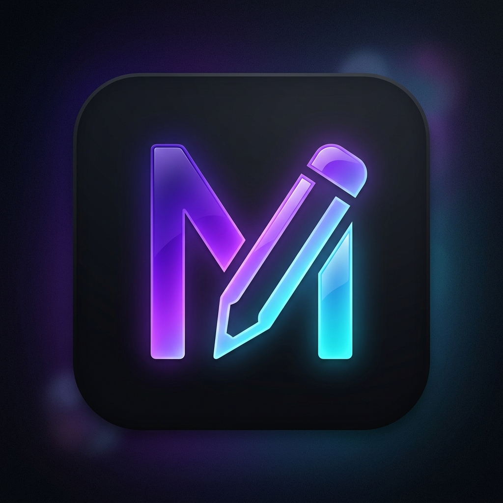

# Antigravity Markdown Editor

A premium, modern, distraction-free Markdown editor inspired by Typora, designed to run smoothly on both Windows and macOS.



## Features

- **Triple-View Modes**:
  - **Editor Mode**: Clean monospace editor pane with full formatting features.
  - **Live Preview Mode**: Clean rendered Markdown document.
  - **Split View**: Synchronized side-by-side editing and preview.
- **Premium Design & Themes**:
  - **Night Owl**: Deep dark theme with glowing accents.
  - **Classic Light**: Soft light contrast slate theme.
  - **Nordic Frost**: Frosty cool gray and blue theme.
  - **Sepia Paper**: High contrast warm reading theme.
- **Writers' Focus Features**:
  - **Zen Mode**: Distraction-free full-screen writing without sidebars or toolbars.
  - **Typewriter Mode**: Keeps the cursor line vertically centered on the screen.
- **Full File & Folder Browsing**:
  - Open a directory to display a file explorer tree in the sidebar.
  - Scan directories and display nested Markdown files (`.md`, `.markdown`, `.txt`).
- **Dynamic Outline navigation**:
  - Real-time headers scanner (H1 - H6) which populates the Outline sidebar.
  - Click on any heading in the outline to smoothly scroll directly to it.
- **Document Stats**:
  - Real-time character counts, word counts, and estimated reading time.
- **Advanced Export Utilities**:
  - Export to beautifully styled PDF.
  - Export to standalone HTML.

## Getting Started

### Prerequisites

Ensure you have [Node.js](https://nodejs.org) (v16.0 or higher) installed.

### Installation

1. Navigate to the project folder:
   ```bash
   cd f:/gowork/clients/markdown-edit
   ```
2. Install npm dependencies:
   ```bash
   npm install
   ```

### Running the App

Start the Electron application locally:
```bash
npm start
```

### Packaging for Production

You can build native standalone installers (`.exe` for Windows, `.dmg` / `.app` for macOS) using `electron-builder`:

#### To Package for Windows:
```bash
npm run package-win
```

#### To Package for macOS:
```bash
npm run package-mac
```

#### To Package for Linux:
```bash
npm run package-linux
```

The compiled native installer files will be located in the `dist/` directory.

---
Created by Antigravity
